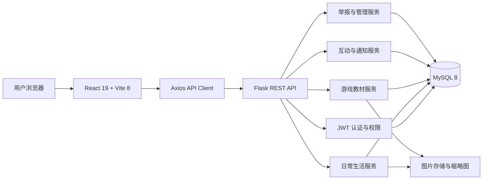

<div align="center">

# 映墨 · Yingmo

### 把生活留在照片里，把经验写成可以反复打开的教材。

<p>
  
  
  
  
  
  
</p>

<br />

```text
           ☁️                         ✦
     📷  今天也值得被留下来        🎮  好用的经验值得被分享
            \                         /
             ───────  映 墨  ───────
```

**一个兼具生活影像记录与游戏知识共享的轻量内容社区。**

[产品说明](docs/product.md) · [UI 规范](docs/ui-style.md) · [协作规则](AGENTS.md)

</div>

---

## 🌿 关于映墨

**映墨**不是追求高速刷屏的内容平台，也不是充满商业感的社区模板。

它更像一本被朋友们共同维护的线上手账：

- 在日常生活区，用照片和文字留下旅行、校园、城市与普通日子；
- 在游戏教材区，把英雄技巧、地图点位和实战经验整理成清晰的步骤；
- 通过点赞、收藏、评论和共同投稿，让内容慢慢沉淀，而不是匆匆消失。

> “映”是被照片留住的光影，  
> “墨”是被文字整理下来的记忆与经验。

映墨希望提供一个**功能完整，但不催促用户；内容丰富，但不显得拥挤**的小型社区空间。

---

## ✨ 两个彼此独立、又共享温度的空间

<table>
<tr>
<td width="50%" valign="top">

### 📷 日常生活

记录旅行、照片和普通日子。

- 按城市、景点、校园、活动或主题组织内容
- 支持多图日常、地点、心情、标签与拍摄时间
- 多位用户可以向同一个生活章节持续投稿
- 支持公开、仅登录用户和仅自己三种可见范围
- 通过评论与互动，留下属于朋友们的共同回忆

</td>
<td width="50%" valign="top">

### 🎮 游戏教材

分享英雄技巧、地图点位和实战经验。

- 以“游戏—英雄—地图—教材”组织知识
- 支持多步骤图文教程与版本信息
- 可按游戏、英雄、地图和技巧类型快速查找
- 英雄与地图统一维护，减少重复内容
- 教材支持有效性状态，方便长期维护

</td>
</tr>
</table>

---

## 🧺 已实现的核心能力

| 模块 | 主要能力 |
| --- | --- |
| 用户与认证 | 注册、登录、退出、Access Token、Refresh Token、登录状态恢复 |
| 日常生活 | 章节、图片上传、多图日常、可见范围、地点、心情、标签 |
| 游戏教材 | 游戏目录、英雄、地图、多步骤图文教材、版本与有效性 |
| 内容互动 | 点赞、收藏、评论、回复、通知 |
| 内容管理 | 草稿、个人中心、公开主页、搜索、发现页 |
| 社区治理 | 举报、内容审核、内容下架、用户限制、管理员日志 |
| 媒体处理 | 图片真实性校验、尺寸限制、WebP 转码、缩略图、访问控制 |
| 主题适配 | 浅色模式、深色模式、响应式布局、中文友好排版 |

---

## 🎨 设计理念

映墨的 UI 遵循一套统一的视觉语言：

### 温暖，而不是甜腻

页面以浅米色、奶油白和浅灰绿为底色，减少纯白页面带来的冰冷感。整体更像一张被认真整理过的纸，而不是标准化的商业后台。

### 克制，而不是寡淡

深绿色只用于按钮、链接、状态和少量视觉锚点。圆角、阴影和动效都保持轻量，不让装饰抢走内容本身。

### 中文友好，而不是模板化

页面重视中文字体、行高、段落节奏和标题层级。文字可以舒展地阅读，照片也拥有足够的呼吸空间。

### 图片优先，交互轻量

生活内容以照片情绪为第一视觉层级；头像、时间、地点、心情、点赞和评论等信息保持低打扰，不制造强社交平台式的压迫感。

### 不同区域，不同信息密度

- 日常生活页更轻、更松弛，突出图片与时间感；
- 游戏教材页更强调结构、步骤和检索效率；
- 管理后台保留温暖色彩，但优先保证信息密度与操作清晰度。

---

## 🏗️ 技术架构



### 前端

- React 19
- Vite 8
- React Router 7
- Axios
- 原生 CSS 设计系统
- 深浅主题与响应式布局

### 后端

- Python 3.12+
- Flask 3.1
- Flask App Factory
- Blueprint 模块化路由
- SQLAlchemy 2
- Flask-Migrate / Alembic
- Flask-JWT-Extended
- Flask-Limiter
- Pillow
- PyMySQL

### 数据与基础设施

- MySQL 8.0+
- UTF-8 `utf8mb4`
- 图片元数据与业务数据分离
- GitHub Actions 持续集成
- Redis 可作为生产环境限流存储

---

## 🗂️ 项目结构

```text
Ying-Mo/
├── backend/                    # Flask 后端
│   ├── app/
│   │   ├── admin/              # 管理与审计
│   │   ├── auth/               # 登录、令牌与会话
│   │   ├── comments/           # 评论与回复
│   │   ├── common/             # 通用响应、限流等
│   │   ├── discovery/          # 发现页数据
│   │   ├── drafts/             # 内容草稿
│   │   ├── games/              # 游戏、英雄与地图
│   │   ├── guides/             # 游戏教材
│   │   ├── interactions/       # 点赞与收藏
│   │   ├── life/               # 日常与生活章节
│   │   ├── models/             # SQLAlchemy 模型
│   │   ├── notifications/      # 通知
│   │   ├── reports/            # 举报流程
│   │   ├── search/             # 全站搜索
│   │   ├── uploads/            # 图片上传与访问
│   │   └── users/              # 用户资料与个人中心
│   ├── migrations/             # 数据库迁移
│   ├── tests/                  # 后端测试
│   ├── requirements.lock.txt   # 锁定依赖
│   └── run.py                  # 开发入口
│
├── frontend/                   # React 前端
│   ├── public/
│   └── src/
│       ├── api/                # API 请求封装
│       ├── auth/               # 登录状态管理
│       ├── components/         # 通用组件
│       ├── layouts/            # 页面布局
│       ├── pages/              # 页面
│       ├── router/             # 路由与权限边界
│       └── styles/             # 设计令牌与页面样式
│
├── docs/
│   ├── product.md              # 产品需求基线
│   └── ui-style.md             # UI 设计规范
│
├── AGENTS.md                   # 开发协作约定
├── index.html                  # V1 静态视觉原型
├── style.css
├── script.js
└── README.md
```

> 根目录中的 V1 静态页面继续作为视觉参考保留；V2 的实际业务位于 `frontend/` 与 `backend/`。

---

## 🚀 本地运行

### 环境要求

请先准备：

- Python 3.12+
- Node.js 22+
- npm
- MySQL 8.0+

---

### 1. 获取项目

```bash
git clone https://github.com/InkSaku/Ying-Mo.git
cd Ying-Mo
```

---

### 2. 启动后端

```bash
cd backend

python3.12 -m venv .venv
source .venv/bin/activate

python -m pip install --upgrade pip
python -m pip install -r requirements.lock.txt

cp .env.example .env
```

打开 `backend/.env`，至少配置：

```env
APP_ENV=development

DATABASE_URL=mysql+pymysql://用户名:密码@127.0.0.1:3306/yingmo?charset=utf8mb4

SECRET_KEY=请替换为强随机字符串
JWT_SECRET_KEY=请替换为另一个不同的强随机字符串

CORS_ORIGINS=http://localhost:5173,http://127.0.0.1:5173
```

可以使用下面的命令生成密钥：

```bash
python -c "import secrets; print(secrets.token_urlsafe(48))"
```

请分别执行两次，并保证 `SECRET_KEY` 与 `JWT_SECRET_KEY` 不同。

初始化数据库：

```bash
python -m flask --app run.py db upgrade
```

启动后端：

```bash
python -m flask --app run.py run
```

默认地址：

```text
http://127.0.0.1:5000
```

健康检查：

```text
GET http://127.0.0.1:5000/api/v1/health
```

---

### 3. 启动前端

新开一个终端：

```bash
cd frontend

npm ci
cp .env.example .env
npm run dev
```

默认访问：

```text
http://127.0.0.1:5173
```

---

## ⚙️ 常用环境变量

| 变量 | 说明 |
| --- | --- |
| `APP_ENV` | `development`、`testing` 或 `production` |
| `DATABASE_URL` | MySQL 数据库连接，必须使用 `mysql+pymysql://` |
| `TEST_DATABASE_URL` | 测试专用数据库，不得与正式数据库相同 |
| `SECRET_KEY` | Flask 应用密钥 |
| `JWT_SECRET_KEY` | JWT 签名密钥，必须与 `SECRET_KEY` 不同 |
| `CORS_ORIGINS` | 允许访问后端的前端来源 |
| `UPLOAD_ROOT` | 图片文件保存目录 |
| `MAX_CONTENT_LENGTH` | multipart 请求体上限 |
| `IMAGE_MAX_BYTES` | 单张图片大小上限 |
| `RATELIMIT_STORAGE_URI` | 限流存储；生产环境建议使用 Redis |
| `REPORT_DAILY_LIMIT` | 单用户每日举报数量上限 |

> 不要提交真实 `.env`、数据库密码、JWT 密钥、邀请码、上传文件、日志或本地数据库。

---

## 🔐 身份与权限

映墨保留了清晰的分级权限体系：

| 身份 | 主要能力 |
| --- | --- |
| 游客 | 浏览公开内容、搜索、查看公开主页 |
| 普通用户 | 发布内容、上传图片、互动、收藏、创建或申请章节、举报 |
| 内容管理员 | 审核章节、处理举报、管理内容与评论、维护游戏目录 |
| 系统管理员 | 管理用户与角色、执行高风险操作、查看管理员日志 |

所有关键权限由后端最终判断。前端路由和按钮隐藏只用于改善体验，不能替代服务端鉴权。

---

## 🛡️ 安全与稳定性

映墨并不是只完成“能用”，也重视小型社区需要的基本安全边界：

- Access Token 与 Refresh Token 分离
- Refresh Token 使用 HttpOnly Cookie
- Refresh Session 数据库存储与轮换
- 登录、注册、上传和搜索接口限流
- 图片真实类型、尺寸、像素和宽高比校验
- EXIF 方向修正与 WebP 重新编码
- 图片归属与绑定状态校验
- 内容可见性由数据库查询层过滤
- 举报领取、处理和重复提交保护
- 管理员高风险操作确认与审计日志
- 统一错误响应与请求 ID
- 生产环境密钥、CORS 和限流存储校验

---

## 🔌 API 约定

所有业务接口统一使用：

```text
/api/v1
```

成功响应：

```json
{
  "data": {},
  "meta": {
    "request_id": "..."
  }
}
```

错误响应：

```json
{
  "error": {
    "code": "VALIDATION_ERROR",
    "message": "请求参数不合法。",
    "details": [],
    "request_id": "..."
  }
}
```

主要接口模块：

```text
/api/v1/auth
/api/v1/users
/api/v1/uploads
/api/v1/life
/api/v1/games
/api/v1/guides
/api/v1/interactions
/api/v1/comments
/api/v1/notifications
/api/v1/drafts
/api/v1/search
/api/v1/discovery
/api/v1/reports
/api/v1/admin
```

---

## 🧪 开发与检查

### 后端

```bash
cd backend
source .venv/bin/activate

python -m pytest
```

测试环境应使用独立的 MySQL 数据库：

```env
TEST_DATABASE_URL=mysql+pymysql://用户名:密码@127.0.0.1:3306/yingmo_test?charset=utf8mb4
```

### 前端

```bash
cd frontend

npm run lint
npm run build
```

### 数据库迁移

修改模型后，应创建并检查迁移：

```bash
cd backend
source .venv/bin/activate

python -m flask --app run.py db migrate -m "describe change"
python -m flask --app run.py db upgrade
```

不要通过手工修改生产数据库来替代迁移文件。

---

## 🧭 当前阶段

映墨 V2 已经完成从静态原型向完整 Web 应用的主体迁移，当前重点是继续打磨真实使用体验。

### 已完成

- [x] React + Flask 前后端架构
- [x] 注册、登录与会话维护
- [x] 图片上传、缩略图与权限控制
- [x] 日常生活内容闭环
- [x] 游戏、英雄、地图与教材结构
- [x] 点赞、收藏、评论与通知
- [x] 草稿、个人中心与公开主页
- [x] 搜索与发现页
- [x] 举报和管理后台
- [x] 多级角色与管理员审计
- [x] 深浅主题与响应式适配
- [x] 基础 CI 与安全回归测试

### 继续打磨

- [ ] 丰富真实内容与默认目录
- [ ] 优化移动端细节
- [ ] 补充更完整的页面截图与演示
- [ ] 完善生产部署与备份流程
- [ ] 持续改善无障碍体验
- [ ] 根据真实使用反馈调整交互

---

## 🤝 协作约定

开始修改代码前，请先阅读：

1. [`docs/product.md`](docs/product.md)：产品需求与业务边界
2. [`AGENTS.md`](AGENTS.md)：技术栈、实现约定与任务汇报规范
3. [`docs/ui-style.md`](docs/ui-style.md)：前端视觉语言与响应式规范

基本原则：

- 一次提交只完成一个可独立验收的任务；
- 不在功能任务中混入无关重构或依赖升级；
- 数据库修改必须附带迁移；
- 权限、可见性和归属必须由后端裁决；
- 不用静态假数据冒充已接通的真实业务；
- 不提交密钥、上传文件、构建产物和本地环境文件；
- 没有实际执行的测试，不声称已经通过。

---

## 🌱 关于这个项目

映墨首先是一个为自己和身边朋友准备的小网站。

它不需要成为最大的社区，也不急着承载复杂的商业目标。只要能够让一张照片、一段旅行、一份游戏经验，在需要的时候被重新找到，它就已经有了存在的意义。

<div align="center">

<br />

```text
   ʕ•ᴥ•ʔ  愿每一段普通日子，都有被认真保存的机会。
```

**Made with patience, photos and a little green.**

</div>
